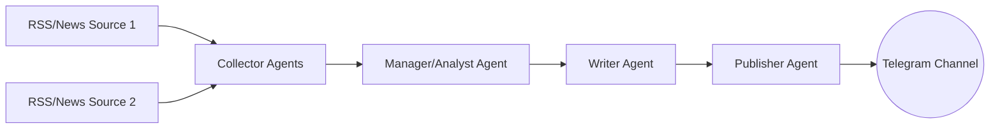
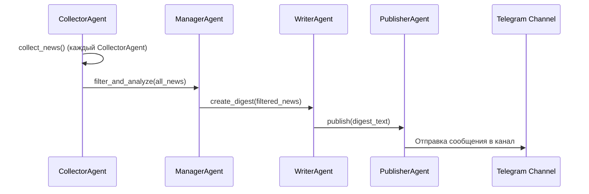

# Учебный проект: Мультиагентная система новостей с использованием ai-pydantic

Этот документ содержит информацию о проекте, в том числе диаграммы, которые можно визуализировать в Obsidian или VSCode markdown editor.

## 1. Цели и общая идея

1. **Собрать** новости из различных источников (RSS, сайты, API)
2. **Обработать** эти новости (фильтрация, анализ, суммаризация)
3. **Опубликовать** итоговую сводку в Телеграм-канале
4. **Отработать** навыки:
   - Использование `ai-pydantic` для создания агентов
   - Применение LLM (OpenAI и др.) для аналитики и генерации текстов
   - Интеграция с Телеграм-ботом
   - *(Опционально)* Векторизация (FAISS) для углублённого анализа

## 2. Архитектура мультиагентной системы

Система организована в виде нескольких специализированных агентов:

1. **Collector Agents** (Исследователи)
   - Сбор новостей по темам/регионам: Ближний Восток, ЕС и др.
   - Включает инструменты для парсинга RSS и работы с API

2. **Manager/Analyst Agent** (Менеджер/Аналитик)
   - Фильтрация, сортировка, первичная аналитика
   - Объединение информации от разных Collector'ов
   - Инструменты для семантического анализа и удаления дубликатов

3. **Writer Agent** (Редактор/Писатель)
   - Формирование итоговой сводки с помощью LLM
   - Многошаговая генерация текста
   - Проверка качества перед публикацией

4. **Publisher Agent** (Публикатор)
   - Автоматический постинг в Телеграм-канал
   - Обработка ошибок публикации

### 2.1. Общий поток данных



## 3. Технологии

1. Python 3.9+
   - Использование виртуального окружения (venv или аналог)

2. ai-pydantic
   - Библиотека для интеграции Pydantic с LLM
   - Декларативное описание агентов и валидация данных

3. FAISS (опционально)
   - Семантический поиск и кластеризация новостей
   - Помогает находить похожие статьи

4. LLM-провайдеры
   - OpenAI GPT для генерации и анализа текстов
   - Можно использовать разные модели для черновой и финальной генерации

5. Telegram Bot API
   - Отправка сообщений в канал
   - Поддерживается через python-telegram-bot или aiogram

6. Планировщик
   - cron, schedule или Celery
   - Регулярный запуск (раз в день или чаще)

## 4. Модели данных и функции агентов

### 4.1. Базовые модели (Pydantic)

```python
# file: data_models.py

from pydantic import BaseModel

class NewsItem(BaseModel):
    source: str
    title: str
    description: str
    full_text: str
    date: str
    region: str

class NewsDigest(BaseModel):
    date_generated: str
    items: list[NewsItem]
    summary: str
```

### 4.2. Collector Agents

```python
# file: agents/collector.py

from pydantic_ai.agents import AgentModel
from typing import List
from data_models import NewsItem

class CollectorAgent(AgentModel):
    region: str
    source_urls: List[str]

    def tool_fetch_rss(self, url: str) -> List[NewsItem]:
        """
        Пример "tool", который парсит RSS или обращается к API.
        Возвращает список NewsItem.
        """
        # Заглушка
        return []

    def collect_news(self) -> List[NewsItem]:
        """
        Собирает новости из source_urls для заданного region.
        """
        all_items = []
        for url in self.source_urls:
            items = self.tool_fetch_rss(url)
            all_items.extend(items)
        return all_items
```

### 4.3. Manager/Analyst Agent

```python
# file: agents/manager.py

from pydantic_ai.agents import AgentModel
from typing import List
from data_models import NewsItem

class ManagerAgent(AgentModel):
    def tool_remove_duplicates(self, news_list: List[NewsItem]) -> List[NewsItem]:
        """
        Пример "tool" для фильтрации дублей.
        """
        unique_titles = set()
        filtered = []
        for item in news_list:
            if item.title not in unique_titles:
                unique_titles.add(item.title)
                filtered.append(item)
        return filtered

    def tool_semantic_filter(self, news_list: List[NewsItem]) -> List[NewsItem]:
        """
        Пример "tool" для семантической фильтрации (если нужно).
        Может использовать FAISS для поиска близких текстов.
        """
        return news_list

    def filter_and_analyze(self, all_news: List[NewsItem]) -> List[NewsItem]:
        """
        Фильтрует, удаляет дубликаты, опционально применяет FAISS.
        """
        result = self.tool_remove_duplicates(all_news)
        result = self.tool_semantic_filter(result)
        return result
```

### 4.4. Writer Agent

```python
# file: agents/writer.py

from pydantic_ai.agents import AgentModel
from pydantic_ai.fields import ChatCompletionRequest
from typing import List
from data_models import NewsItem

class WriterAgent(AgentModel):
    def create_digest(self, news_list: List[NewsItem]) -> str:
        """
        Генерирует итоговую сводку (дайджест) с помощью LLM.
        """
        user_message = "Составь краткую сводку следующих новостей:\n"
        for item in news_list:
            user_message += f"- {item.title}: {item.description}\n"

        request = ChatCompletionRequest(
            system_message="You are an expert news summarizer.",
            user_message=user_message
        )

        response = self.complete_request(request)
        return response.choices[0].message["content"]
```

### 4.5. Publisher Agent

```python
# file: agents/publisher.py

import os
from pydantic_ai.agents import AgentModel
from telegram import Bot

class PublisherAgent(AgentModel):
    def publish(self, digest_text: str) -> None:
        """
        Отправляет сгенерированный дайджест в Телеграм-канал.
        """
        telegram_token = os.getenv("TELEGRAM_BOT_TOKEN")
        chat_id = os.getenv("TELEGRAM_CHANNEL_ID")

        bot = Bot(token=telegram_token)
        bot.send_message(chat_id=chat_id, text=digest_text)
```

## 5. Взаимодействие агентов



## 6. Структура проекта

```
my_news_project/
│
├─ data_models.py
│
├─ agents/
│   ├─ __init__.py
│   ├─ collector.py     # CollectorAgent
│   ├─ manager.py       # ManagerAgent
│   ├─ writer.py        # WriterAgent
│   └─ publisher.py     # PublisherAgent
│
├─ main.py              # Точка входа (конвейер)
├─ requirements.txt
├─ README.md
└─ .env                 # TELEGRAM_BOT_TOKEN, TELEGRAM_CHANNEL_ID, и т.д.
```

## 7. Конвейер (main.py)

```python
# file: main.py

from agents.collector import CollectorAgent
from agents.manager import ManagerAgent
from agents.writer import WriterAgent
from agents.publisher import PublisherAgent
from typing import List
from data_models import NewsItem

def main():
    # 1. Инициализация агентов
    collector_me = CollectorAgent(region="Middle East", source_urls=["https://rss.me.com", "..."])
    collector_eu = CollectorAgent(region="Europe", source_urls=["https://rss.eu.com", "..."])
    manager = ManagerAgent()
    writer = WriterAgent()
    publisher = PublisherAgent()

    # 2. Сбор новостей
    news_me: List[NewsItem] = collector_me.collect_news()
    news_eu: List[NewsItem] = collector_eu.collect_news()
    all_news = news_me + news_eu

    # 3. Аналитика
    filtered_news = manager.filter_and_analyze(all_news)

    # 4. Генерация дайджеста
    digest_text = writer.create_digest(filtered_news)

    # 5. Публикация в Телеграм
    publisher.publish(digest_text)

if __name__ == "__main__":
    main()
```

## 8. Запуск и автоматизация

1. Установка зависимостей:
```bash
pip install -r requirements.txt
```

2. Настройка окружения (.env):
```
TELEGRAM_BOT_TOKEN="ваш_токен"
TELEGRAM_CHANNEL_ID="ид_канала"
```

3. Запуск:
```bash
python main.py
```

4. Автоматизация:
   - Использовать cron или планировщик задач
   - Или библиотеку schedule для периодического запуска

## 9. Полезные ссылки

- [Документация ai-pydantic](https://github.com/jxnl/instructor)
- [Примеры промптов для LLM](https://github.com/openai/openai-cookbook)
- [Шаблоны для мониторинга](https://github.com/prometheus/client_python)
- [Python-Telegram-Bot документация](https://python-telegram-bot.org/)
- [FAISS документация](https://github.com/facebookresearch/faiss)

## 10. Рекомендации по разработке

1. Начните с MVP:
   - Один CollectorAgent для одного источника
   - Базовая фильтрация без FAISS
   - Простой шаблон для дайджеста

2. Добавляйте функционал постепенно:
   - Новые источники и регионы
   - Улучшенная аналитика с FAISS
   - Разные стили дайджестов

3. Ведите логирование:
   - Отслеживайте работу каждого агента
   - Записывайте ошибки и предупреждения
   - Сохраняйте статистику

4. Используйте возможности ai-pydantic:
   - Валидация входных/выходных данных
   - Повторные запросы при ошибках
   - Структурированные ответы от LLM

## 11. Заключение

Этот проект демонстрирует практическое применение мультиагентного подхода для создания автоматизированной системы обработки новостей. Он сочетает современные технологии обработки естественного языка с практическими аспектами разработки, такими как работа с API, базами данных и планировщиками задач.

Система легко масштабируется добавлением новых источников новостей, улучшением алгоритмов анализа или изменением формата выходных данных. При возникновении вопросов по реализации или развитию проекта обращайтесь к документации или в сообщество разработчиков.